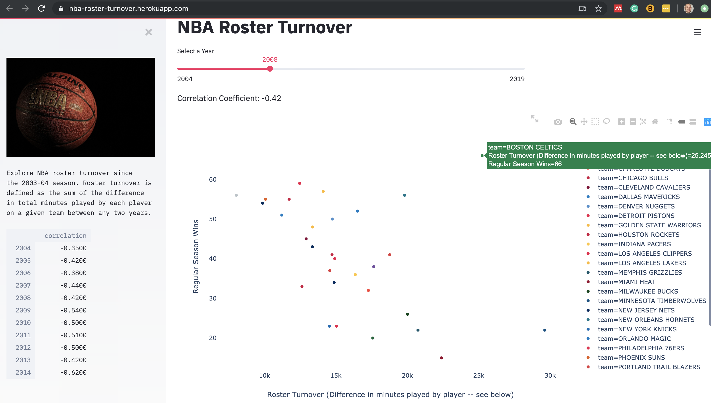

# NBA Roster Turnover
Explore NBA roster turnover from year to year and the correlation it has with team wins. 
Roster turnover is defined as the sum of the total difference between minutes played by each player from
year to year. There is a significant negative correlation with higher turnover and regular season wins.

This was built with [streamlit](https://streamlit.io/) and deployed with [heroku](https://www.heroku.com/).

**The outlier team shown in the screenshot is the Boston Celtics in 2008, which is the year
the Celtics added Ray Allen and Kevin Garnett to their team.**
